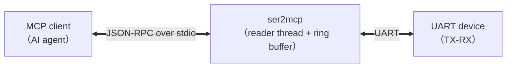

# ser2mcp

[](https://github.com/woooooooooolf/ser2mcp/actions/workflows/ci.yml)
[](https://github.com/woooooooooolf/ser2mcp/releases)
[](LICENSE-MIT)
[](https://github.com/woooooooooolf/ser2mcp)
[](https://github.com/woooooooooolf/ser2mcp/fork)
[](https://github.com/woooooooooolf/ser2mcp/commits/main)
[](https://github.com/woooooooooolf/ser2mcp/releases)

[](https://github.com/woooooooooolf/ser2mcp/releases)
[](https://github.com/woooooooooolf/ser2mcp/releases)
[](https://github.com/woooooooooolf/ser2mcp/releases)
[](https://github.com/woooooooooolf/ser2mcp/actions)


**English** | [简体中文](README.md)

**UART serial port MCP server**: exposes local serial port devices as standard **MCP (Model Context Protocol)** tools, so AI assistants (Claude Desktop, Cursor, or any MCP client) can read and write serial ports directly.



## Features

- **14 MCP tools**: list ports, open, runtime re-configuration, write, read, write+read, expect output, send-on-match, status, clear buffer, close, file send (estimate / send / cancel)
- **Streaming file send**: `uart_send_file` sends a local file to the serial port in rate-limited chunks in one call (raw `text` / `base64` with automatic line wrapping), replacing per-chunk `uart_write` calls by the model; with `uart_send_estimate` for time estimation and three-level abort via `uart_send_cancel` / `uart_close` / client cancel notification; progress is queryable while sending
- **Full serial parameter control**: baudrate / data bits (5-8) / parity (none/even/odd) / stop bits (1,2) / flow control (none/software/hardware) / read timeout — all settable via `uart_open` / `uart_configure`
- **Configurable internal parameters**: ring buffer size `buffer_size` (default 1 MiB), idle detection `idle_ms`, per-call fetch cap `max_bytes`, total timeout `timeout_ms`, reader timeout `read_timeout_ms` (default 500ms; safety cap only, does not affect latency)
- **Event-driven / non-blocking reader thread (platform adaptation layer)**: Unix (Linux/macOS) uses `poll(2)` + self-pipe events; Windows uses 1ms polling + `bytes_to_read()` gating + `timeBeginPeriod(1)`, calling `read()` only when data is ready, so read/write latency is decoupled from the read-timeout parameter
- **Continuous ingress buffering**: the event-driven reader thread continuously buffers serial data into a ring buffer; when full, the oldest data is overwritten and an **overflow counter** is incremented. Return values carry `overflow_delta / overflow_total`, so data gaps are detectable
- **Binary-safe**: data travels as hex strings (e.g. `"41 54 0D 0A"`); `mode="text"` switches to UTF-8 text; `read_mode="text-escaped"` keeps text primary and escapes non-text bytes as `\xNN` (no fallback for terminal/log scenarios)
- **Single-binary delivery**: `cargo build --release` produces one executable; Windows / Linux / macOS — no extra runtime required

## Quick Install

> You can also download prebuilt binaries for your platform (Windows / Linux / macOS) from the [Releases](https://github.com/woooooooooolf/ser2mcp/releases) page.

```bash
# 1. Clone the repository
git clone https://github.com/woooooooooolf/ser2mcp.git
cd ser2mcp

# 2. Linux system dependency (Debian/Ubuntu only; skip on macOS/Windows)
sudo apt-get install -y libudev-dev

# 3. Build the release binary
cargo build --release
# Artifact: target/release/ser2mcp (ser2mcp.exe on Windows)

# 4. Sanity check (optional): list local serial ports
target/release/ser2mcp --list-ports

# 5. Register as an MCP server (see "Connecting to MCP Clients" below)
```

**Verify a successful install**: after registration, calling `uart_list_ports` should return the local port list (possibly an empty array); with TX-RX loopback hardware, data sent via `uart_exchange` should come back unchanged.

## Build & Test

> **Linux users**: `serialport` needs `libudev` to enumerate USB port information.
> Debian/Ubuntu: `sudo apt-get install -y libudev-dev`

```bash
cargo build --release   # build
cargo test              # unit + end-to-end MCP protocol tests (no serial hardware needed)
cargo doc --no-deps     # generate Rust docs
```

## Command Line

After downloading a prebuilt binary or building from source, you can run:

```bash
ser2mcp --list-ports   # enumerate local serial ports
ser2mcp --version      # show version
ser2mcp --help         # show help
```

Running without arguments starts the MCP server in stdio mode (for AI assistants).

## Connecting to MCP Clients

MCP clients launch the server as a stdio subprocess. Generic configuration (`.mcp.json`, Claude Desktop, etc.):

```json
{
  "mcpServers": {
    "ser2mcp": {
      "command": "/absolute/path/to/ser2mcp",
      "args": []
    }
  }
}
```

Windows example: `"command": "C:\\tools\\ser2mcp.exe"`.

### Install as a Reasonix plugin package (recommended, zero manual config)

In Reasonix, install the repository as a plugin package:

> Install the ser2mcp plugin package from https://github.com/woooooooooolf/ser2mcp. Use install_source with kind="auto" (or "plugin").

The root `reasonix-plugin.json` declares ser2mcp as a standard MCP server (`bin/` ships prebuilt Windows / Linux / macOS binaries plus a cross-platform launcher script):

1. Run `install_source` in Reasonix: **point the source at the repository URL** `https://github.com/woooooooooolf/ser2mcp`; use kind `auto` (detected as a plugin package) or explicit `plugin`; scope defaults to `global`
2. Reasonix copies the whole repository into its global plugin directory (Windows: `%APPDATA%\reasonix\plugins\ser2mcp`); the manifest's `command` (relative path `bin/ser2mcp.cmd`) resolves against the plugin package root — **no manual path edits needed**
3. After install, a server named `ser2mcp` is registered; tools are exposed as `mcp__ser2mcp__uart_*`
4. **Verify**: call `uart_list_ports` after registration; it should return the local serial port list (possibly an empty array)

> `bin/ser2mcp.cmd` is the cross-platform launcher (Unix picks `ser2mcp` / `ser2mcp-macos` via `uname`, Windows calls `ser2mcp.exe`; keep it pure ASCII — cmd.exe misparses non-ASCII bytes on non-UTF-8 code pages).
>
> Offline install: point `install_source` at a local path (a local clone or an extracted release package) — it installs the same plugin-package way.

Environment variables (optional):

| Variable   | Default | Description                                                      |
|------------|---------|------------------------------------------------------------------|
| `RUST_LOG` | `info`  | Log level (logs go to **stderr**, never polluting the stdio protocol channel) |

## Tool Reference

| Tool | Description |
|---|---|
| `uart_list_ports` | Enumerate local serial ports (name / type / USB description) |
| `uart_open` | Open a port and start the background reader thread (`port` required; all serial parameters + internal params like `buffer_size`) |
| `uart_configure` | Re-configure a running port (`port` required; only updates passed fields) |
| `uart_write` | Send data, return immediately (`port` required; no reply waiting) |
| `uart_read` | Pull buffered ingress data (`port` required) |
| `uart_exchange` | Send + read in one step (`port` required; most common) |
| `uart_expect` | Wait for a matching output: block until a specified pattern appears on the port or until timeout (`port`, `pattern` required; optional `data` for one-step "send + wait") |
| `uart_expect_send` | Send on match: wait for a pattern, then send `reply` in the same critical section (`port`, `pattern`, `reply` required) |
| `uart_available` | Status snapshot: config, buffered bytes, total overflow, reader-thread errors, file-send progress (`port` required) |
| `uart_clear` | Clear unread buffered data (`port` required) |
| `uart_close` | Close the port and release the handle (`port` required; an in-flight file send is interrupted) |
| `uart_send_estimate` | Estimate file-send bytes and duration (`path` required; no port needed, `baudrate` defaults to 115200) |
| `uart_send_file` | Streaming file send: send a local file to the port in rate-limited chunks, one call (`port`, `path` required) |
| `uart_send_cancel` | Abort an in-flight `uart_send_file` (`port` required; no-op when idle) |

> **Multi-port & pass-through**: multiple ports can be open at the same time; the port name (e.g. `COM3`, `/dev/ttyUSB0`) is the handle, and every tool except `uart_list_ports` requires a `port` argument. The byte stream is passed through **as-is**: ser2mcp does not parse or filter content (`uart_expect` / `uart_expect_send` only search the buffer conditionally without modifying data), so unexpected data is returned unchanged for the AI / upper layer to interpret.

### Data Representation (hex / text / text-escaped)

| Encoding | Send (`mode`) | Return (`read_mode`) | Description |
|---|---|---|---|
| `hex` (default) | ✅ | ✅ | Two uppercase hex chars per byte, space-separated; binary-safe |
| `text` | ✅ | ✅ | UTF-8 string; on return, falls back to hex **as a whole** if any byte is non-text (strict check) |
| `text-escaped` | ❌ | ✅ | Text-first: printable UTF-8 kept as-is, `\r` `\n` `\t` preserved, control bytes (e.g. ESC of ANSI color codes) and invalid UTF-8 bytes escaped as `\xNN`, literal `\` escaped as `\\`; always readable, never falls back |

> **Terminal commands must end with a line terminator**: `uart_write` / `uart_exchange` / `uart_expect` accept a `newline` argument for `data` (`none` default / `lf` appends `\n` / `crlf` appends `\r\n`). Interactive terminals (shell, uboot, …) do not execute a command until it receives a carriage return; a command sent without a terminator also **stays in the device line buffer and merges with the next command** (measured: `"ls"` followed by `"ls /"` actually executes `"lsls /"`). So for terminal scenarios explicitly pass `newline="crlf"` or include `\r\n` in `data`.

### Choosing an Encoding by Scenario (Minimal Examples)

**Interactive terminal (Linux Shell / uboot)**: commands need a line terminator to execute; output often contains ANSI color codes.

```
uart_exchange {port: "COM3", data: "ls /", mode: "text", newline: "crlf", read_mode: "text-escaped"}
```

- `newline="crlf"` appends `\r\n` automatically, so the command executes on return;
- `read_mode="text-escaped"` keeps text primary and escapes control bytes (e.g. `\x1B[...`), keeping the whole output readable;
- for multi-command flows, use `uart_expect` on a prompt anchor (e.g. `pattern: "# "`) to judge command completion.

**MCU / AT command debugging**: protocols are byte-exact; no bytes should be appended implicitly.

```
uart_exchange {port: "COM3", data: "AT\r\n", mode: "text"}            // text command, terminator included in data
uart_exchange {port: "COM3", data: "AA 55 01 00 0D 0A", mode: "hex"}  // binary frame, exact hex transfer
```

- The defaults `newline="none"` and `mode="hex"` keep behavior identical to older versions and suit any protocol;
- return `mode="text"` works only when the data is pure text — any non-text byte falls the whole result back to hex; switch to `read_mode="text-escaped"` in that case.

### File Send (uart_send_estimate → uart_send_file)

For large payloads (a few KB or more — firmware download / file transfer), **do not call `uart_write` chunk by chunk**: every call costs a protocol round-trip and tokens. Use `uart_send_file` — the server loops over chunks (`chunk_size`) with an optional inter-chunk gap (`gap_ms`) internally; the model calls once.

**Typical flow (model perspective):**

```
1. uart_send_estimate {path, mode?, chunk_size?, gap_ms?, baudrate?}
   → estimate sent bytes and duration first (no port needed)
2. uart_send_file {port, path, mode?, chunk_size?, gap_ms?}
   → send; returns raw_bytes / sent_bytes / chunks / elapsed_ms / overflow stats
3. Reconcile: compare with the peer's wc -c / md5sum (sent_bytes ↔ wc -c; raw_bytes ↔ decoded byte count)
```

**Parameters & semantics:**

| Param | Description |
|---|---|
| `port` | Port name (required) |
| `path` | Local file path (required; the server validates existence, regular file, readability) |
| `mode` | `text` (default, raw bytes) / `base64` (encoded, wrapped every 76 chars with a trailing `\n`; good for a peer `cat > file` under icanon line buffering) |
| `chunk_size` | Chunk size in raw bytes, default 256. **The model's responsibility**: check the peer tty limits first (e.g. `stty -a` for line buffer / `icanon`) and the baud rate; pick `chunk_size` ≤ buffer limit, err on the small side — without flow control, an oversized chunk loses bytes irrecoverably |
| `gap_ms` | Inter-chunk gap in ms, default 0 (the per-chunk flush already rate-limits to the baud rate) |

**Key points:**

- **Only "get the bytes out"**: no format parsing, no automatic EOF. If the peer needs EOF, send `\x04` via `uart_write` (usually triggers EOF under icanon; if unreliable, use `dd bs=1 count=N` on the peer to stop after N bytes)
- **base64 inflation**: actual bytes ≈ file_size × 4/3 + newlines (one per 76 chars); when picking `chunk_size`, divide the peer tty buffer by ~1.34
- **Duration estimate**: 8N1 formula `time ≈ sent_bytes × 10 / baudrate + chunks × gap_ms`; 1 MiB @ 115200 ≈ 87 s — estimate first and warn the user about the expected wait
- **`io_lock` is held during the send**: `uart_configure` / `uart_close` queue until it finishes; `uart_available` is unaffected and reports `send` progress (`active` / `sent_bytes` / `total_bytes` / `chunks` / `last_reason`)
- **Abort**: `uart_send_cancel` (checkpoint exit, at most one extra chunk), `uart_close` (interrupts the send, then closes), or a client `notifications/cancelled`; on abort it returns `reason="cancelled"` plus sent stats so the model can reconcile and decide whether to resend
- **Device-error awareness**: if the reader thread detects a fatal error (e.g. the serial device was physically unplugged), the send aborts at the next checkpoint with `reason="device_error"` plus `device_error` details — the write side may still "fake-success" (bytes enter the driver buffer while the device is gone), so trust this field and reconcile with the peer
- **Partial failure**: write / read errors return an error that includes bytes/chunks already sent

**Real-board notes** (tested on an actual Linux board):

- **Run `stty raw` on the peer before receiving binary (`text` mode)**: the default tty IXON flow control consumes `\x11`/`\x13` (Ctrl-Q/S) inside the data and ICRNL translates `\r`, corrupting the payload; `stty raw` disables all translations
- **A trailing `\r\n` on a command line leaves a stray `\n` in the peer tty** (`\r` delivers the line, `\n` is left for the next reader), so `cat`/`dd` pick up an extra leading byte — account for it when reconciling, or use `newline="lf"` for commands
- **Ending `cat`**: under base64 + icanon, `uart_write {data: "04"}` (`\x04` EOF) usually works; reconcile with `base64 -d | wc -c` / `md5sum`

### Read Semantics (Core Design)

Serial ingress is **continuously buffered** by the background reader thread and **pulled on demand** by tools. `uart_read` / `uart_exchange` return all unread data when any of these three conditions is met:

1. **Idle detection**: starting from the moment the **last byte** was received by the ring buffer, no new bytes for `idle_ms` (default 300ms) and no bytes left in the driver buffer → the response is considered complete (`reason: "idle"`)
2. **Cap reached**: unread bytes ≥ `max_bytes` (default 64 KiB) → prevents backlog (`reason: "max_bytes"`)
3. **Total timeout**: waiting exceeds `timeout_ms` (default 5000ms) (`reason: "timeout"`)

Example return value:

```json
{
  "data": "41 54 0D 0A 4F 4B 0D 0A",
  "bytes": 8,
  "mode": "hex",
  "reason": "idle",
  "overflow_delta": 0,
  "overflow_total": 0,
  "buffered_bytes": 0
}
```

> `overflow_delta > 0` means bytes were overwritten since the last read because the buffer was full — data has gaps; increase `buffer_size` or read more frequently.

> **`idle_ms` semantics**: it measures the **silent gap inside a response** — chunks separated by less than `idle_ms` merge into one response, more than `idle_ms` split into two. It must be **larger than the device's response gap** (otherwise responses get truncated); lowering it reduces round-trip latency (judgement precision is limited by the 10ms poll). Note it measures "silence in the byte stream", **not command execution time** — for slow operations (taking seconds), do not wait by raising `idle_ms`; use `uart_expect` with an output anchor instead (see next section).

### Content-Match Semantics (uart_expect / uart_expect_send)

Unlike the **time-based semantics** (idle detection) of `uart_read` / `uart_exchange`, the expect tools are **content-based**: they wait until a given string appears in the ingress, then return (or time out). This moves the "is the device ready?" decision into the server (match returns in milliseconds) and replaces AI-side `sleep` + blind-send timing loops:

- `uart_expect {port, pattern: "Zynq>", pattern_mode: "text"}`: wait for a prompt; optional `data` sends first, one-step "send + wait"
- `uart_expect_send {port, pattern: "Hit any key", reply: "\n", pattern_mode: "text"}`: press a key the moment the pattern appears — wins the bootdelay window

Behavior notes:

- **Exact substring match** (case-sensitive), no regex; patterns split across multiple read chunks or across ring-buffer wrap are still matched
- **Historical data matches immediately**: data already buffered at call time (e.g. bootlog accumulated after `uart_open`) participates in the search — may hit without waiting
- **consume semantics**: `consume=true` (default) takes and returns everything up to and including the pattern; bytes after the pattern stay buffered (readable later via `uart_read`). `consume=false` waits without consuming
- **timeout semantics**: if not matched within `timeout_ms` (default 5000), returns `matched=false`, `reason="timeout"`; data is not consumed (left buffered for diagnosis)
- **overflow caveat**: if the buffer overflows and overwrites the pattern and the device never resends it, expect waits until timeout; `overflow_delta > 0` in the result helps identify this
- **ANSI-immune**: pattern matching runs on the raw bytes and is independent of the return encoding — when device output contains ANSI color codes, a plain-text keyword (e.g. `"login:"`, `"# "`) still matches; read the result with `read_mode="text-escaped"`
- **Residual data**: after `consume=true`, bytes after the pattern stay buffered and mix into the next `uart_read` / `uart_exchange` result (normal semantics — they are unread data); use `uart_clear` or drain with `uart_read` first when exact alignment matters

### Usage Pattern: Short Commands + Output Anchors (recommended)

- Send one **short command** at a time, then determine completion immediately — never blind-wait with `sleep`
- Prefer **output anchors** to judge completion: `uart_expect` waits for a prompt/keyword (e.g. shell `# `, `$ `, or a device status string); once the anchor appears, the command is done — send the next one; use `uart_expect_send` for "act on match"
- Fall back to `uart_exchange` idle semantics only when the device has no clear anchor (e.g. AT commands)
- For slow operations (taking seconds), do not raise `timeout_ms` and wait idly — use `uart_expect` on an anchor; it returns in milliseconds once matched

## Typical Usage (AI Agent Perspective)

```
1. uart_list_ports                      → find "COM3"
2. uart_open {port: "COM3", baudrate: 115200}
3. uart_exchange {port: "COM3", data: "41 54 0D 0A"}  → AT command (hex, terminator included)
4. uart_exchange {port: "COM3", data: "ls /", mode: "text", newline: "crlf", read_mode: "text-escaped"}  → terminal command (see scenario above)
5. uart_expect {port: "COM3", pattern: "Zynq>", pattern_mode: "text"}  → wait for prompt (timing)
6. uart_expect_send {port: "COM3", pattern: "Hit any key", reply: "\n", pattern_mode: "text"}  → press key on match (bootdelay window)
7. uart_configure {port: "COM3", baudrate: 9600}      → re-configure after device baudrate switch
8. uart_close {port: "COM3"}
```

> **Latency note (for AI tools)**: ser2mcp uses an event-driven / non-blocking reader thread (Unix `poll`, Windows 1ms polling); `read_timeout_ms` (default 500ms) is only a safety cap for `read()` and does not affect latency. The fixed wait per read/write round-trip comes mainly from `idle_ms` (default 300ms) — tuning guidance is in the `idle_ms` semantics note above.

## Loopback Self-Test (Real Hardware, TX-RX Jumpered)

Built-in one-command self-test: enumerate ports + run a full loopback verification on a given port (sends the full 0x00-0xFF byte sequence and verifies it comes back unchanged):

```bash
cargo run --release --example loopback -- --list      # enumerate local ports
cargo run --release --example loopback -- COM3 115200 # loopback test
```

## Module Layout

```
src/
├── main.rs      # entry point: stdio transport
├── lib.rs       # crate docs & module declarations
├── hex.rs       # hex encode/decode (hex/text/text-escaped triple mode)
├── ring.rs      # bounded ring buffer (overwrite-oldest + overflow counter + Notify + pattern search)
├── manager.rs   # serial manager (open / re-configure / reader thread / write / pull / expect)
├── reader.rs    # event-driven / non-blocking reader thread (platform adaptation layer)
└── server.rs    # MCP tool layer (11 tools + ServerHandler)
tests/
└── e2e.rs       # end-to-end MCP protocol tests (real subprocess handshake)
examples/
├── loopback.rs      # loopback self-test tool
└── latency_probe.rs # latency probe (bench/benchw, real-hardware load test)
```

## Tech Stack

- [rmcp](https://github.com/modelcontextprotocol/rust-sdk) (official Rust MCP SDK)
- [serialport](https://crates.io/crates/serialport)
- tokio / serde / schemars

## Security Notice

ser2mcp gives AI assistants direct read/write access to your serial ports: any authorized MCP client (and the model behind it) can send arbitrary bytes to connected devices. Only connect devices you trust, make sure your MCP client and model are from reliable sources, and do not use this tool with devices that could be damaged by incorrect commands.

## Troubleshooting

- **Permission denied / cannot open `/dev/ttyUSB0` on Linux**: your user is not in the `dialout` (or `uucp`) group. Run `scripts/linux-serial-permissions.sh` as root, then log out and back in.
- **Port open failure / port busy**: make sure no other serial terminal or MCP instance is using the port.
- **No ports found on Windows**: check that the USB-to-serial driver (CH340 / CP210x, etc.) is installed.
- **High tool-call latency**: the fixed wait per read/write round-trip comes mainly from `idle_ms` (default 300ms); lower it to match the device response rhythm (e.g. 50ms). `read_timeout_ms` (default 500ms) is only a safety cap and does not affect latency.
- **Missing / incomplete data**: `overflow_delta > 0` means data was dropped due to buffer overflow; increase `buffer_size` or pull data more frequently.

## License

MIT OR Apache-2.0 (see [LICENSE-MIT](LICENSE-MIT) and [LICENSE-APACHE](LICENSE-APACHE))
