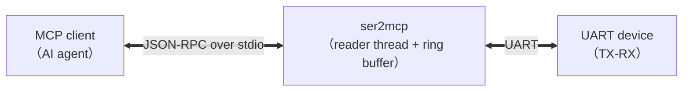

# ser2mcp

[](https://github.com/woooooooooolf/ser2mcp/actions/workflows/ci.yml)
[](https://github.com/woooooooooolf/ser2mcp/releases)
[](LICENSE-MIT)
[](https://github.com/woooooooooolf/ser2mcp)
[](https://github.com/woooooooooolf/ser2mcp/fork)
[](https://github.com/woooooooooolf/ser2mcp/commits/main)
[](https://github.com/woooooooooolf/ser2mcp/releases)

[](https://github.com/woooooooooolf/ser2mcp/releases)
[](https://github.com/woooooooooolf/ser2mcp/releases)
[](https://github.com/woooooooooolf/ser2mcp/releases)
[](https://github.com/woooooooooolf/ser2mcp/actions)


**English** | [简体中文](README.md)

**UART serial port MCP server**: exposes local serial port devices as standard **MCP (Model Context Protocol)** tools, so AI assistants (Claude Desktop, Cursor, or any MCP client) can read and write serial ports directly.



## Features

- **9 MCP tools**: list ports, open, runtime re-configuration, write, read, write+read, status, clear buffer, close
- **Full serial parameter control**: baudrate / data bits (5-8) / parity (none/even/odd) / stop bits (1,2) / flow control (none/software/hardware) / read timeout — all settable via `uart_open` / `uart_configure`
- **Configurable internal parameters**: ring buffer size `buffer_size` (default 1 MiB), idle detection `idle_ms`, per-call fetch cap `max_bytes`, total timeout `timeout_ms`, reader timeout `read_timeout_ms` (default 500ms; safety cap only, does not affect latency)
- **Event-driven / non-blocking reader thread (platform adaptation layer)**: Unix (Linux/macOS) uses `poll(2)` + self-pipe events; Windows uses 1ms polling + `bytes_to_read()` gating + `timeBeginPeriod(1)`, calling `read()` only when data is ready, so read/write latency is decoupled from the read-timeout parameter
- **No data loss or blocking on ingress**: the event-driven reader thread continuously buffers serial data into a ring buffer; when full, the oldest data is overwritten and an **overflow counter** is incremented. Return values carry `overflow_delta / overflow_total`, so data gaps are detectable
- **Binary-safe**: data travels as hex strings (e.g. `"41 54 0D 0A"`); `mode="text"` switches to UTF-8 text
- **Single-binary delivery**: `cargo build --release` produces one executable; Windows / Linux / macOS — no extra runtime required

## Quick Install

> You can also download prebuilt binaries for your platform (Windows / Linux / macOS) from the [Releases](https://github.com/woooooooooolf/ser2mcp/releases) page.

```bash
# 1. Clone the repository
git clone https://github.com/woooooooooolf/ser2mcp.git
cd ser2mcp

# 2. Linux system dependency (Debian/Ubuntu only; skip on macOS/Windows)
sudo apt-get install -y libudev-dev

# 3. Build the release binary
cargo build --release
# Artifact: target/release/ser2mcp (ser2mcp.exe on Windows)

# 4. Sanity check (optional): list local serial ports
target/release/ser2mcp --list-ports

# 5. Register as an MCP server (see "Connecting to MCP Clients" below)
```

**Verify a successful install**: after registration, calling `uart_list_ports` should return the local port list (possibly an empty array); with TX-RX loopback hardware, data sent via `uart_exchange` should come back unchanged.

## Build & Test

> **Linux users**: `serialport` needs `libudev` to enumerate USB port information.
> Debian/Ubuntu: `sudo apt-get install -y libudev-dev`

```bash
cargo build --release   # build
cargo test              # unit + end-to-end MCP protocol tests (no serial hardware needed)
cargo doc --no-deps     # generate Rust docs
```

## Command Line

After downloading a prebuilt binary or building from source, you can run:

```bash
ser2mcp --list-ports   # enumerate local serial ports
ser2mcp --version      # show version
ser2mcp --help         # show help
```

Running without arguments starts the MCP server in stdio mode (for AI assistants).

## Connecting to MCP Clients

MCP clients launch the server as a stdio subprocess. Generic configuration (`.mcp.json`, Claude Desktop, etc.):

```json
{
  "mcpServers": {
    "ser2mcp": {
      "command": "/absolute/path/to/ser2mcp",
      "args": []
    }
  }
}
```

Windows example: `"command": "C:\\tools\\ser2mcp.exe"`.

Environment variables (optional):

| Variable   | Default | Description                                                      |
|------------|---------|------------------------------------------------------------------|
| `RUST_LOG` | `info`  | Log level (logs go to **stderr**, never polluting the stdio protocol channel) |

## Tool Reference

| Tool | Description |
|---|---|
| `uart_list_ports` | Enumerate local serial ports (name / type / USB description) |
| `uart_open` | Open a port and start the background reader thread (`port` required; all serial parameters + internal params like `buffer_size`) |
| `uart_configure` | Re-configure a running port (`port` required; only updates passed fields) |
| `uart_write` | Send data, return immediately (`port` required; no reply waiting) |
| `uart_read` | Pull buffered ingress data (`port` required) |
| `uart_exchange` | Send + read in one step (`port` required; most common) |
| `uart_available` | Status snapshot: config, buffered bytes, total overflow, reader-thread errors (`port` required) |
| `uart_clear` | Clear unread buffered data (`port` required) |
| `uart_close` | Close the port and release the handle (`port` required) |

> **Multi-port & pass-through**: multiple ports can be open at the same time; the port name (e.g. `COM3`, `/dev/ttyUSB0`) is the handle, and every tool except `uart_list_ports` requires a `port` argument. The byte stream is passed through **as-is**: ser2mcp does not parse, match or filter content, so unexpected data is returned unchanged for the AI / upper layer to interpret.

### Read Semantics (Core Design)

Serial ingress is **continuously buffered** by the background reader thread and **pulled on demand** by tools. `uart_read` / `uart_exchange` return all unread data when any of these three conditions is met:

1. **Idle detection**: after new data arrives, no new bytes for `idle_ms` (default 300ms) → the response is considered complete (`reason: "idle"`)
2. **Cap reached**: unread bytes ≥ `max_bytes` (default 64 KiB) → prevents backlog (`reason: "max_bytes"`)
3. **Total timeout**: waiting exceeds `timeout_ms` (default 5000ms) (`reason: "timeout"`)

Example return value:

```json
{
  "data": "41 54 0D 0A 4F 4B 0D 0A",
  "bytes": 8,
  "mode": "hex",
  "reason": "idle",
  "overflow_delta": 0,
  "overflow_total": 0,
  "buffered_bytes": 0
}
```

> `overflow_delta > 0` means bytes were overwritten since the last read because the buffer was full — data has gaps; increase `buffer_size` or read more frequently.

## Typical Usage (AI Agent Perspective)

```
1. uart_list_ports                      → find "COM3"
2. uart_open {port: "COM3", baudrate: 115200}
3. uart_exchange {port: "COM3", data: "41 54 0D 0A"}  → send "AT\r\n", wait for reply
4. uart_configure {port: "COM3", baudrate: 9600}      → re-configure after device baudrate switch
5. uart_close {port: "COM3"}
```

> **Latency note (for AI tools)**: ser2mcp uses an event-driven / non-blocking reader thread (Unix `poll`, Windows 1ms polling); `read_timeout_ms` (default 500ms) is only a safety cap for `read()` and does not affect latency. The fixed wait per read/write round-trip comes mainly from `idle_ms` (default 300ms); lower it (e.g. 50ms) for `uart_exchange` / `uart_read` if you need lower latency — but keep it larger than the device's response gap, or the response may be truncated.

## Loopback Self-Test (Real Hardware, TX-RX Jumpered)

Built-in one-command self-test: enumerate ports + run a full loopback verification on a given port (sends the full 0x00-0xFF byte sequence and verifies it comes back unchanged):

```bash
cargo run --release --example loopback -- --list      # enumerate local ports
cargo run --release --example loopback -- COM3 115200 # loopback test
```

## Module Layout

```
src/
├── main.rs      # entry point: stdio transport
├── lib.rs       # crate docs & module declarations
├── hex.rs       # hex encode/decode (hex/text dual mode)
├── ring.rs      # bounded ring buffer (overwrite-oldest + overflow counter + Notify)
├── manager.rs   # serial manager (open / re-configure / reader thread / write / pull)
├── reader.rs    # event-driven / non-blocking reader thread (platform adaptation layer)
└── server.rs    # MCP tool layer (9 tools + ServerHandler)
tests/
└── e2e.rs       # end-to-end MCP protocol tests (real subprocess handshake)
examples/
├── loopback.rs      # loopback self-test tool
└── latency_probe.rs # latency probe (bench/benchw, real-hardware load test)
```

## Tech Stack

- [rmcp](https://github.com/modelcontextprotocol/rust-sdk) (official Rust MCP SDK)
- [serialport](https://crates.io/crates/serialport)
- tokio / serde / schemars

## Security Notice

ser2mcp gives AI assistants direct read/write access to your serial ports: any authorized MCP client (and the model behind it) can send arbitrary bytes to connected devices. Only connect devices you trust, make sure your MCP client and model are from reliable sources, and do not use this tool with devices that could be damaged by incorrect commands.

## Troubleshooting

- **Permission denied / cannot open `/dev/ttyUSB0` on Linux**: your user is not in the `dialout` (or `uucp`) group. Run `scripts/linux-serial-permissions.sh` as root, then log out and back in.
- **Port open failure / port busy**: make sure no other serial terminal or MCP instance is using the port.
- **No ports found on Windows**: check that the USB-to-serial driver (CH340 / CP210x, etc.) is installed.
- **High tool-call latency**: the fixed wait per read/write round-trip comes mainly from `idle_ms` (default 300ms); lower it to match the device response rhythm (e.g. 50ms). `read_timeout_ms` (default 500ms) is only a safety cap and does not affect latency.
- **Missing / incomplete data**: `overflow_delta > 0` means data was dropped due to buffer overflow; increase `buffer_size` or pull data more frequently.

## License

MIT OR Apache-2.0 (see [LICENSE-MIT](LICENSE-MIT) and [LICENSE-APACHE](LICENSE-APACHE))
