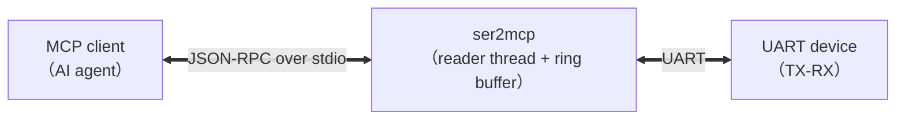

# ser2mcp

[](https://github.com/woooooooooolf/ser2mcp/actions/workflows/ci.yml)
[](LICENSE-MIT)

**English** | [简体中文](README.md)

**UART serial port MCP server**: exposes local serial port devices as standard **MCP (Model Context Protocol)** tools, so AI assistants (Reasonix, Claude Desktop, Cursor, or any MCP client) can read and write serial ports directly.



## Features

- **9 MCP tools**: list ports, open, runtime re-configuration, write, read, write+read, status, clear buffer, close
- **Full serial parameter control**: baudrate / data bits (5-8) / parity (none/even/odd) / stop bits (1,2) / flow control (none/software/hardware) / read timeout — all settable via `uart_open` / `uart_configure`
- **Configurable internal parameters**: ring buffer size `buffer_size` (default 1 MiB), idle detection `idle_ms`, per-call fetch cap `max_bytes`, total timeout `timeout_ms`
- **No data loss or blocking on ingress**: a background reader thread continuously buffers serial data into a ring buffer; when full, the oldest data is overwritten and an **overflow counter** is incremented. Return values carry `overflow_delta / overflow_total`, so data gaps are detectable
- **Binary-safe**: data travels as hex strings (e.g. `"41 54 0D 0A"`); `mode="text"` switches to UTF-8 text
- **Single-binary delivery**: `cargo build --release` produces one executable; Windows / Linux / macOS — no extra runtime required

## Quick Install

```bash
# 1. Clone the repository
git clone https://github.com/woooooooooolf/ser2mcp.git
cd ser2mcp

# 2. Linux system dependency (Debian/Ubuntu only; skip on macOS/Windows)
sudo apt-get install -y libudev-dev

# 3. Build the release binary
cargo build --release
# Artifact: target/release/ser2mcp (ser2mcp.exe on Windows)

# 4. Sanity check (optional): list local serial ports
cargo run --release --example loopback -- --list

# 5. Register as an MCP server (see "Connecting to MCP Clients" below)
```

**Verify a successful install**: after registration, calling `uart_list_ports` should return the local port list (possibly an empty array); with TX-RX loopback hardware, data sent via `uart_exchange` should come back unchanged.

## Build & Test

> **Linux users**: `serialport` needs `libudev` to enumerate USB port information.
> Debian/Ubuntu: `sudo apt-get install -y libudev-dev`

```bash
cargo build --release   # build
cargo test              # unit + end-to-end MCP protocol tests (no serial hardware needed)
cargo doc --no-deps     # generate Rust docs
```

## Connecting to MCP Clients

MCP clients launch the server as a stdio subprocess. Generic configuration (`.mcp.json`, Claude Desktop, etc.):

```json
{
  "mcpServers": {
    "ser2mcp": {
      "command": "/absolute/path/to/ser2mcp",
      "args": []
    }
  }
}
```

Windows example: `"command": "C:\\tools\\ser2mcp.exe"`.
Reasonix project configuration (`reasonix.toml`) example:

```toml
[[plugins]]
name    = "ser2mcp"
command = "/absolute/path/to/ser2mcp"
```

Environment variables (optional):

| Variable   | Default | Description                                                      |
|------------|---------|------------------------------------------------------------------|
| `RUST_LOG` | `info`  | Log level (logs go to **stderr**, never polluting the stdio protocol channel) |

## Tool Reference

| Tool | Description |
|---|---|
| `uart_list_ports` | Enumerate local serial ports (name / type / USB description) |
| `uart_open` | Open a port and start the background reader thread (all serial parameters + internal params like `buffer_size`) |
| `uart_configure` | Re-configure a running port (only updates passed fields) |
| `uart_write` | Send data, return immediately (no reply waiting) |
| `uart_read` | Pull buffered ingress data |
| `uart_exchange` | Send + read in one step (most common) |
| `uart_available` | Status snapshot: config, buffered bytes, total overflow, reader-thread errors |
| `uart_clear` | Clear unread buffered data |
| `uart_close` | Close the port and release the handle |

### Read Semantics (Core Design)

Serial ingress is **continuously buffered** by the background reader thread and **pulled on demand** by tools. `uart_read` / `uart_exchange` return all unread data when any of these three conditions is met:

1. **Idle detection**: after new data arrives, no new bytes for `idle_ms` (default 300ms) → the response is considered complete (`reason: "idle"`)
2. **Cap reached**: unread bytes ≥ `max_bytes` (default 64 KiB) → prevents backlog (`reason: "max_bytes"`)
3. **Total timeout**: waiting exceeds `timeout_ms` (default 5000ms) (`reason: "timeout"`)

Example return value:

```json
{
  "data": "41 54 0D 0A 4F 4B 0D 0A",
  "bytes": 8,
  "mode": "hex",
  "reason": "idle",
  "overflow_delta": 0,
  "overflow_total": 0,
  "buffered_bytes": 0
}
```

> `overflow_delta > 0` means bytes were overwritten since the last read because the buffer was full — data has gaps; increase `buffer_size` or read more frequently.

## Typical Usage (AI Agent Perspective)

```
1. uart_list_ports                      → find "COM3"
2. uart_open {port: "COM3", baudrate: 115200}
3. uart_exchange {data: "41 54 0D 0A"}  → send "AT\r\n", wait for reply
4. uart_configure {baudrate: 9600}      → re-configure after device baudrate switch
5. uart_close
```

## Loopback Self-Test (Real Hardware, TX-RX Jumpered)

Built-in one-command self-test: enumerate ports + run a full loopback verification on a given port (sends the full 0x00-0xFF byte sequence and verifies it comes back unchanged):

```bash
cargo run --release --example loopback -- --list      # enumerate local ports
cargo run --release --example loopback -- COM3 115200 # loopback test
```

## Module Layout

```
src/
├── main.rs      # entry point: stdio transport
├── lib.rs       # crate docs & module declarations
├── hex.rs       # hex encode/decode (hex/text dual mode)
├── ring.rs      # bounded ring buffer (overwrite-oldest + overflow counter + Notify)
├── manager.rs   # serial manager (open / re-configure / reader thread / write / pull)
└── server.rs    # MCP tool layer (9 tools + ServerHandler)
tests/
└── e2e.rs       # end-to-end MCP protocol tests (real subprocess handshake)
examples/
└── loopback.rs  # loopback self-test tool
```

## Tech Stack

- [rmcp](https://github.com/modelcontextprotocol/rust-sdk) (official Rust MCP SDK)
- [serialport](https://crates.io/crates/serialport)
- tokio / serde / schemars

## License

MIT OR Apache-2.0 (see [LICENSE-MIT](LICENSE-MIT) and [LICENSE-APACHE](LICENSE-APACHE))
